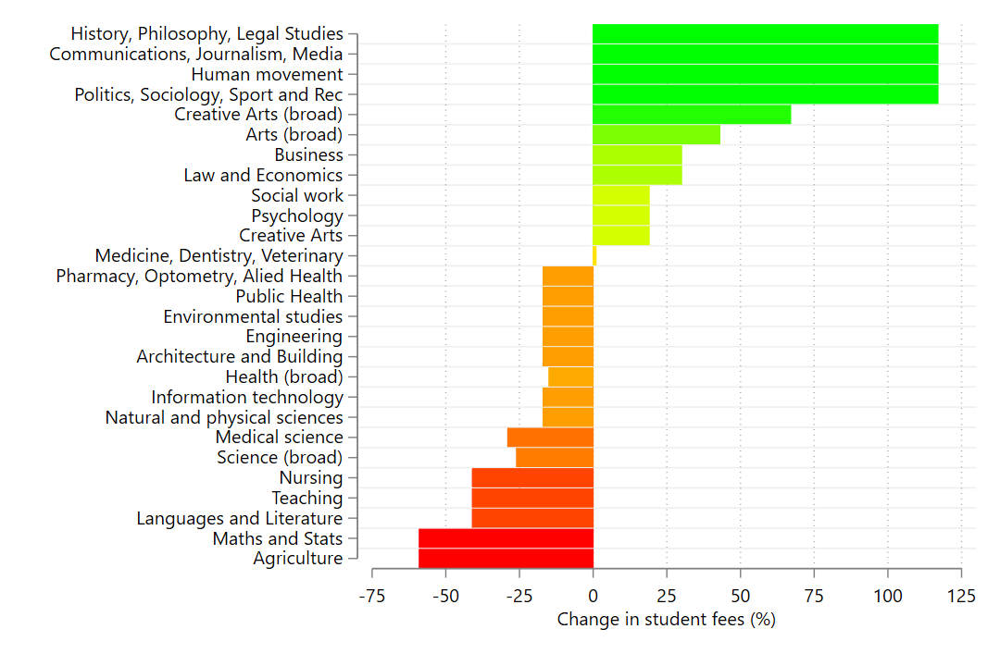

# How to make Stata graphs with colour gradients 

This is an example of the code needed to create a Stata bar chart with conditional colouring of the plotted bars. 

 

Note: **colour gradients were introduced only in Stata 18**. The code will not work with earlier versions of Stata. 

You can either download the do-file in the repo, or paste the following code directly into Stata. 

## Native graphing command

    webuse set https://www.jankabatek.com/datasets/
    webuse gradient_data, clear
     
    twoway bar FEE_CHANGE id, colorvar(FEE_CHANGE) colorstart(red) colorend(lime) colorcuts(-75(1)75) clegend(off) barwidth(0.9) horizontal ylabel(1(1)27,val labs(small)) ytitle("") xtitle("Change in student fees (%)") xlabel(-75(25)125) name(GRDNT1,replace)  

The same command using the do-file syntax: 

    webuse set https://www.jankabatek.com/datasets/
    webuse gradient_data, clear
     
    twoway bar FEE_CHANGE id, colorvar(FEE_CHANGE) colorstart(red) colorend(lime)    /// essential colour gradient options
       colorcuts(-75(1)75)                                                           /// finer gradient options. Try adding: colorrule(lin)
       clegend(off)                                                                  /// getting rid of the colour legend (it's messy)
       barwidth(0.9)                                                                 /// making the bars look nicer 
       horizontal ylabel(1(1)27,val labs(small)) ytitle("")                          /// twoway options
       xtitle("Change in student fees (%)") xlabel(-75(25)125) name(GRDNT1,replace)  

## Plot suite

We can make the same chart using the [plot suite](https://github.com/jankabatek/plotsuite). This way, we can combine the chart with other complex visual elements:

    webuse set https://www.jankabatek.com/datasets/
    webuse gradient_data, clear
    net install plottabs, from("https://raw.githubusercontent.com/jankabatek/plotsuite/master/ado/") replace
    ssc install schemepack
      
    plotmeans FEE_CHANGE, over(id) clear gr(bar) ci(off) colorvar(y_val1) colorstart(red) colorend(lime) colorcuts(-75(1)75) clegend(off) scheme(white_tableau)	barwidth(0.9) horizontal ylabel(1(1)27,val labs(small)) ytitle("") xtitle("Change in student fees (%)") xlabel(-75(25)125) name(GRDNT2,replace)  

The same command using the do-file syntax: 

    webuse set https://www.jankabatek.com/datasets/
    webuse gradient_data, clear
    net install plottabs, from("https://raw.githubusercontent.com/jankabatek/plotsuite/master/ado/") replace
    ssc install schemepack
     
    plotmeans FEE_CHANGE, over(id) clear gr(bar) ci(off)                    /// plotmeans options
       colorvar(y_val1) colorstart(red) colorend(lime)                      /// essential colour gradient options (note the different variable in colorvar - this is because plotmeans stores the plotted data in a separate frame with standardized variable names) 
       colorcuts(-75(1)75)                                                  /// finer gradient options. Try adding: colorrule(lin)
       clegend(off)                                                         /// getting rid of the colour legend (it's messy)
       barwidth(0.9)                                                        /// making the bars look nicer 
       scheme(white_tableau)                                                /// nicer scheme, thx to Asjad 
       horizontal ylabel(1(1)27,val labs(small)) ytitle("")                 /// twoway options
       xtitle("Change in student fees (%)") xlabel(-75(25)125) name(GRDNT2,replace)  

## Coefplot

We can also make the same chart using the [coefplot]([https://github.com/jankabatek/plotsuite](https://repec.sowi.unibe.ch/stata/coefplot/getting-started.html)). Doing so however requires running regressions / creating matrices (see below):

    webuse set https://www.jankabatek.com/datasets/
    webuse gradient_data, clear
    ssc install coefplot
    ssc install schemepack

    reg FEE_CHANGE ibn.id, nocons

    coefplot, recast(bar) grid(between glpattern(solid) glcolor(gs15)) colorvar(FEE_CHANGE) colorstart(red) colorend(lime) colorcuts(-75(1)75) clegend(off) barwidth(0.9) scheme(white_tableau)	 xtitle("Change in student fees (%)") xlabel(-75(25)125) name(GRDNT3,replace)  
        
The same command using the do-file syntax: 

    webuse set https://www.jankabatek.com/datasets/
    webuse gradient_data, clear
    ssc install coefplot
    ssc install schemepack
     
    reg FEE_CHANGE ibn.id, nocons

    coefplot, recast(bar) grid(between glpattern(solid) glcolor(gs15))      /// coefplot options (incl. nicer horizontal grid lines)
       colorvar(FEE_CHANGE) colorstart(red) colorend(lime)                  /// essential colour gradient options 
       colorcuts(-75(1)75)                                                  /// finer gradient options. Try adding: colorrule(lin)
       clegend(off)                                                         /// getting rid of the colour legend (it's messy)
       barwidth(0.9)                                                        /// making the bars look nicer  
       scheme(white_tableau)                                                /// nicer scheme, thx to Asjad 
       xtitle("Change in student fees (%)") xlabel(-75(25)125) name(GRDNT3,replace)  

   
